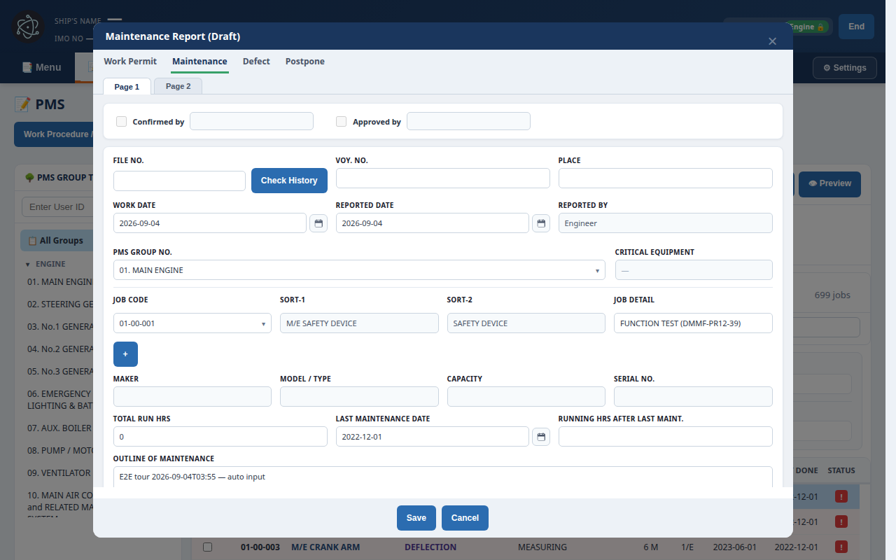
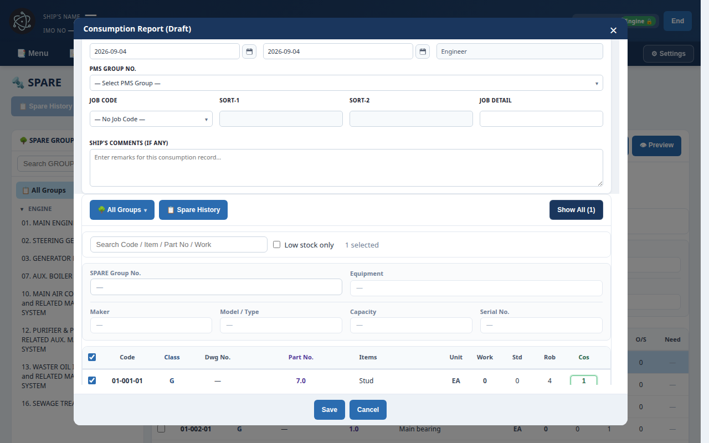

# TVC-PMS E2E Test Report

**Generated:** 2026-09-04 (Playwright Chromium, web demo on `http://127.0.0.1:4173`)  
**Suite:** `npm run test:e2e` — **2 passed** (mobile 390px audit + Deck→Engine sequential tour)  
**Raw probe dump:** [`e2e/artifacts/findings.json`](e2e/artifacts/findings.json)

This report is the CEO-requested auto-tour: login (Deck / Engine) → Work Report input → spare consumption (부품 차감) → menu/tab switching, plus a **390px** overflow / overlap / clip scan.

---

## Executive summary

| Area | Result |
| --- | --- |
| Deck login (`officer` / `0000` / Deck) | Pass |
| Engine login (`engineer` / `0000` / Engine) | Pass |
| Menu flow clicks (Check PMS, Confirm Report, Backup, SPARE cards, …) | Pass |
| PMS → select job → **Make Report** → fill outline → Save | Pass (Deck + Engine) |
| SPARE → **Make Consumption Report** → Cos=1 → Save | Pass (Engine) |
| Tab switching (Menu / PMS / SPARE / History / Settings) | Pass |
| Mobile 390×844 walk | Pass (probes recorded layout defects) |

The click-through **did not hang** on Sign In / seed boot. Functional defects below are real product issues the tour hit, not harness failures.

---

## 1. Functional defects (buttons / lists / JS)

### P1 — Mobile drawer swallows **End** (logout)

When the hamburger drawer is open, `#mobileNavBackdrop` sits over the header **End** button. A normal tap never reaches `handleLogout()`. Playwright had to call `TVC_App.handleLogout()` to leave the app.

**Repro:** Engine login → 390px → open hamburger → tap **End**.  
**Screenshot:** [`logout-stuck-on-app.png`](e2e/artifacts/screenshots/logout-stuck-on-app.png), [`mobile-390-nav-open.png`](e2e/artifacts/screenshots/mobile-390-nav-open.png)

**Fix:** Close the drawer (or ignore backdrop hits) on header actions. Give `#mobileNavBtn` `z-index` above the drawer so the hamburger can close itself. Do not let `aria-hidden` backdrop intercept `pointer-events` on the sticky header.

### P1 — Hamburger cannot close the drawer

With `aria-expanded="true"`, the 280px `#tabBar` covers `#mobileNavBtn`. The only close path is the dimmed backdrop. If the user aims at the hamburger (standard pattern), the tap hits **📑 Menu** instead.

**Fix:** Keep a 44×44 close control in the header (`z-index: 160+`), or inset the drawer below the header instead of `top: 0`.

### P2 — Deck SPARE list is empty despite 1,335 parts

Deck `officer` can open the SPARE tab (`CCR` shows the tab). The inventory counter reads **0 / 1335** and the sheet says **No parts to display.** Engine later rendered parts and completed consumption.

**Screenshot:** [`spare-empty-Deck_officer.png`](e2e/artifacts/screenshots/spare-empty-Deck_officer.png)

**Fix:** If Deck is allowed to view SPARE, default **All Groups** must list parts (or show “Loading inventory…” while XLS seed finishes). If Deck must not consume, hide **Make Consumption Report** and show an explicit empty-state reason — not a blank grid.

### P2 — Uncaught `Unexpected token '??'`

Four page exceptions during login/tour (`deck` / `engine` / mobile). Chromium 140 parses `??` natively, so this is likely a **non-JS payload evaluated as script** (bad `type`, worker, or `eval` of JSON). It did not block Sign In, but it is a real console crash.

**Fix:** Capture `error.filename` / stack in DevTools on first Sign In; reject scripts that are not `application/javascript`.

### Probe noise (not filed as product bugs)

Many “button covered” hits are **below the fold** (`y ≈ 843`) or **under an open drawer**. Those are listed in `findings.json` only.

---

## 2. Mobile 390px UI/UX findings

### Ship header is unreadable

`.cmaxs-header` tries to show logo + ship name + IMO/Delivery/User + **Engine 🔒** + **End** on one row. At 390px the identity collapses to `IM… · Vessel Mode - …`.

**Screenshot:** [`mobile-390-menu.png`](e2e/artifacts/screenshots/mobile-390-menu.png)

**Fix:** One-line identity = hamburger + logo + short ship name. Move IMO / Delivery / User into a second wrap row or an “i” popover. Hide `.dept-label`. Keep **End** 44×44.

### PMS is still a desktop split view

`.tree-panel` stays beside `.plan-main`. On 390px the user only sees the group tree; the job sheet, Period filter, **Filter / Clear / 699 jobs**, and dashboard chips sit off-screen or collide with Print / Preview.

**Screenshot:** [`mobile-390-pms.png`](e2e/artifacts/screenshots/mobile-390-pms.png)

**Fix:** `@media (max-width: 420px)` stack: collapsed “PMS Group” accordion on top, job cards below. Sticky footer for **Make Report**. Hide Print/Preview behind a ⋯ menu.

### History table and legend do not fit

Period date fields, a dense W/M/D/P/C legend, and a wide `colgroup` (SORT-1/2, flags, spare data) overflow past `x=350+`. Filter / Clear / entry count sit around `x=360–500`.

**Screenshot:** [`mobile-390-history.png`](e2e/artifacts/screenshots/mobile-390-history.png)

**Fix:** Mobile columns = Type + File No + Status only. Legend → compact chip row or “Legend” disclosure. Horizontal snap on the table is a last resort.

### Work Report / Consumption modals are desktop-wide

Desktop tour filled and saved both forms (see below). At 390px the same modals keep multi-column grids (Maker / Model / Capacity / Serial; Cos table). Probe overlap includes WR kind tabs vs the off-canvas tab drawer.

**Screenshots:** [`mobile-390-work-report.png`](e2e/artifacts/screenshots/mobile-390-work-report.png), [`work-report-Engine_engineer.png`](e2e/artifacts/screenshots/work-report-Engine_engineer.png)

**Fix:** Single-column fields; 44px qty steppers; actions pinned as a safe-area footer (`Save` / `Cancel`).

---

## 3. What the tour actually clicked

| Step | Deck `officer` | Engine `engineer` |
| --- | --- | --- |
| Sign in + department | Yes | Yes |
| Menu cards (Check PMS, Confirm Report, Backup, SPARE cards, …) | 7 items | 8 items (incl. Running Hours) |
| PMS job row + **Make Report** + outline + Save | Yes | Yes |
| Work Report Page 2 qty | Attempted | Attempted |
| SPARE + **Make Consumption Report** + Cos=1 + Save | List empty — skipped | Yes (`01-001-01` Stud, Rob 4 → Cos 1) |
| History PMS/SPARE scopes | Yes | Yes |
| Settings modal | Yes | Yes |
| Tab cycle Menu → PMS → History → Menu | Yes | Yes |

Desktop evidence:





---

## 4. Recommended fixes (priority)

1. **Drawer vs header hit-testing (P1).** Header (`#mobileNavBtn`, **End**) must stay above `#tabBar` / `#mobileNavBackdrop`. Close the drawer on **End**.
2. **390px information architecture (P1 UX).** Stack PMS/SPARE tree + list; card rows instead of 10+ column sheets; two-line header.
3. **Deck SPARE empty state (P2).** Explain 0 / 1335 or show the parts Deck is allowed to see.
4. **Find the `??` parse error (P2).** One stack trace will tell you which file is not JS.
5. **Touch targets.** `#planReportBtn` / `#spareMakeConsumeBtn` as full-width sticky footers; date inputs not side-by-side at 390px.
6. **History mobile.** Type / File No / Status only; move SORT and Spare Data into Detail Report.

Suggested CSS sketch (do **not** replace `index.html` wholesale):

```css
@media (max-width: 420px) {
  .cmaxs-header { flex-wrap: wrap; min-height: 56px; }
  .ship-meta { display: none; } /* or second row */
  .plan-layout, .actual-layout { flex-direction: column; }
  .tree-panel { max-height: 36vh; }
  .hist-col-sort1, .hist-col-sort2, .hist-col-flag { display: none; }
  #mobileNavBtn, .cmaxs-header .btn-red { position: relative; z-index: 160; }
}
```

---

## 5. How to re-run

```bash
npx playwright install chromium
npm run test:e2e
```

- Config: [`playwright.config.js`](playwright.config.js) — serves the repo on port **4173**, one worker, 180s timeout.
- Tour: [`e2e/tour.spec.js`](e2e/tour.spec.js)
- Mobile audit: [`e2e/mobile-ui.spec.js`](e2e/mobile-ui.spec.js)
- Screenshots: [`e2e/artifacts/screenshots/`](e2e/artifacts/screenshots/)

Does **not** replace `index.html` or `js/auth.js`. Does **not** require `.env`.

---

## Screenshot index

| File | What it shows |
| --- | --- |
| [`mobile-390-menu.png`](e2e/artifacts/screenshots/mobile-390-menu.png) | Clipped header; PMS + SPARE work-flow cards |
| [`mobile-390-pms.png`](e2e/artifacts/screenshots/mobile-390-pms.png) | Tree-only PMS; job sheet off-canvas |
| [`mobile-390-work-report.png`](e2e/artifacts/screenshots/mobile-390-work-report.png) | Work Report modal at 390px |
| [`mobile-390-spare.png`](e2e/artifacts/screenshots/mobile-390-spare.png) | SPARE at 390px |
| [`mobile-390-history.png`](e2e/artifacts/screenshots/mobile-390-history.png) | History density + header clip |
| [`mobile-390-nav-open.png`](e2e/artifacts/screenshots/mobile-390-nav-open.png) | Drawer covering hamburger / End |
| [`mobile-390-login.png`](e2e/artifacts/screenshots/mobile-390-login.png) | Sign-in at 390px |
| [`logout-stuck-on-app.png`](e2e/artifacts/screenshots/logout-stuck-on-app.png) | End tap did not leave the app |
| [`spare-empty-Deck_officer.png`](e2e/artifacts/screenshots/spare-empty-Deck_officer.png) | 0 / 1335 parts for Deck |
| [`work-report-Deck_officer.png`](e2e/artifacts/screenshots/work-report-Deck_officer.png) | Deck Work Report draft |
| [`work-report-Engine_engineer.png`](e2e/artifacts/screenshots/work-report-Engine_engineer.png) | Engine Work Report draft |
| [`spare-consume-Engine_engineer.png`](e2e/artifacts/screenshots/spare-consume-Engine_engineer.png) | Engine Cos=1 consumption |
