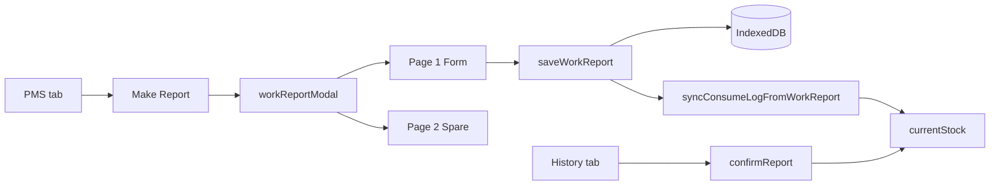

# TVC-PMS UI Map

Screen → DOM → JavaScript mapping for AI and human developers.  
**Last aligned with codebase:** 2026-09-04.

---

## 1. App shell

```
#appShell
├── header.cmaxs-header          # Ship name, user, Dept toggle, End (logout)
├── #tabBar                      # Main navigation
└── #tabContent
    ├── #tab-menu                # Menu home
    ├── #tab-actual              # PMS (Actual Plan)
    ├── #tab-spare               # SPARE inventory
    └── #tab-history             # Report History
```

| Tab id | Label | `TVC_App.switchTab` | Primary render |
|--------|-------|---------------------|----------------|
| `menu` | 📑 Menu | `switchTab('menu')` | `renderCmaxsMenu` / menu cards |
| `actual` | 📝 PMS | `switchTab('actual')` | `renderActualPlan`, tree + job sheet |
| `spare` | 🔩 SPARE | `switchTab('spare')` | `TVC_SpareMenu` inventory |
| `history` | 📜 Report History | `switchTab('history')` | `renderWorkHistory` |

**Settings:** `#settingsOpenBtn` → `TVC_Settings.open()` → `#settingsModal`

**Mobile:** `#mobileNavBtn` + `#mobileNavBackdrop` — drawer over `#tabBar`. See [`MOBILE-UX.md`](MOBILE-UX.md).

---

## 2. Station modes (`TVC_Space`)

| Login mode | Station | Fixed dept | Notes |
|------------|---------|------------|-------|
| MASTER | CAPTAIN | DECK+ENGINE | Hub export |
| DECK | CCR | DECK | `officer`, `captain` |
| ENGINE | ECR | ENGINE | `engineer`, `ce` |
| HQ | — | toggled | Fleet list in menu |

`TVC_Space.getUiFeatures(user)` gates tabs (e.g. SPARE visibility).

---

## 3. Menu → navigation

Menu cards call `TVC_App.menuAction(...)` or `menuNavigate(tab, opts)`.

| Menu action | Result |
|-------------|--------|
| `checkPlan` | PMS tab, filter `overdue` |
| `checkCritical` | PMS tab, filter `critical` |
| `inputReport` | PMS tab, filter `total` |
| `approveReport` | History (or HQ approve UI) |
| `runHour` | `#runHoursModal` |

---

## 4. PMS (Actual Plan) tab

```
#tab-actual
├── .tree-panel              # PMS group tree
└── .plan-main / sheet       # Virtual list of jobs
    ├── #planReportBtn       # "Make Report" → openWorkReportInput()
    ├── Work Procedure       # openWorkProcedure()
    └── Batch selection      # openBatchReport()
```

| User action | Entry function | Opens |
|-------------|----------------|-------|
| Make Report | `TVC_App.openWorkReportInput()` | `#workReportModal` |
| Work Procedure | `TVC_App.openWorkProcedure(jobId)` | `#workProcedureModal` |
| Batch report | `TVC_App.openBatchReport()` | `#workReportModal` (batch) |

**Report kind tabs** (inside report modals): Maintenance · Defect · Postpone · Work Permit  
→ `TVC_App.switchMakeReportKind('repair'|'defect'|'postpone'|'permit')`

---

## 5. Modals (index.html shells)

| Modal `#id` | Body `#id` | Controller | Purpose |
|-------------|------------|------------|---------|
| `workReportModal` | `workReportBody` | `TVC_App` | Maintenance / Postpone work report |
| `defectReportModal` | `defectReportBody` | `TVC_DefectReport` | Defect case report |
| `workPermitModal` | `workPermitBody` | `TVC_WorkPermitReport` | Work permit |
| `workProcedureModal` | `workProcedureBody` | `TVC_App` | Job procedure text + attachments |
| `spareConsumeModal` | `spareConsumeBody` | `TVC_SpareMenu` | Consumption report (list + editor) |
| `spareReqListModal` | `spareReqListBody` | `TVC_SpareMenu` | Requisition list |
| `spareReqWorkModal` | `spareReqWorkBody` | `TVC_SpareMenu` | Requisition editor |
| `spareReceiveModal` | `spareReceiveBody` | `TVC_SpareMenu` | Receive / delivery |
| `spareDetailModal` | `spareDetailBody` | `TVC_SpareMenu` | Part detail |
| `jobDetailModal` | `jobDetailBody` | `TVC_App` | Legacy job detail |
| `runHoursModal` | — | `TVC_RunHours` | Running hours update |
| `settingsModal` | — | `TVC_Settings` | App settings |

Shared modal CSS classes: `.modal-box.wr-modal` (1000px wide on desktop), `.spare-req-work-modal`.

---

## 6. Work Report (`#workReportModal`)

### Structure

```
#workReportBody
├── .wr-titlebar
├── .wr-report-kind-tabs     # Permit | Maintenance | Defect | Postpone
├── .wr-pagetabs-bar         # Page 1 | Page 2 (Maintenance only)
└── .wr-page
    ├── Page 1 body          # renderWrRepairMaintenanceBody / renderWrPostponeBody
    └── Page 2 body          # TVC_SpareMenu.renderWrSparePage2Html (spare pick)
└── .modal-actions.wr-actions
```

### Key `TVC_App` functions

| Function | Role |
|----------|------|
| `openWorkReport(jobId, tab, opts)` | New report session |
| `openWorkReportFromHistory(...)` | History open view/edit |
| `renderWorkReportModal()` | Full re-render |
| `renderWrRepairMaintenanceBody(job, opts)` | Maintenance form HTML |
| `renderWrPostponeBody(job, opts)` | Postpone form HTML |
| `captureWorkReportForm()` | Read `[data-wf]` fields → `state._wrForm` |
| `saveWorkReport()` | Persist + spare sync |
| `setWorkReportPage('1'|'2')` | Page tab switch |
| `switchMakeReportKind(kind)` | Switch to defect/permit modal |

### Form state

- `state._wrForm` — field bag (`defaultWrForm()`)
- `state._wrUsedParts` — spare lines `{ spare_part_id, qty_used, ... }`
- `state._wrPage` — `'1'` | `'2'`
- `state._wrTab` — `'repair'` | `'postpone'`

### Maintenance Page 1 fields (current)

Always visible today: File No, Voy, Place, dates, PMS group, job rows, maker/model, run hrs, outline, footer (labor, comments, attachments).

**Planned (not yet in UI):** routine-only fields + Trouble/Defect toggle — see open task in `GEMINI-COLLAB.md`.

### Maintenance Page 2 (spare)

| Function | File |
|----------|------|
| `renderWrSparePage2Html` | `spareMenu.js` |
| `initWrSparePage2` / `teardownWrSparePage2` | `spareMenu.js` |
| `persistWrSpareUsedParts` | `spareMenu.js` |
| `syncConsumeLogFromWorkReport` | `spareMenu.js` |

### Footer buttons (current)

| Context | Buttons |
|---------|---------|
| New session | **Save**, **Cancel** |
| History view | Nav, Modify, Delete, Print, Close |
| History edit | Save, Cancel |

**Planned:** 임시저장 (Draft) + 제출 (Submit) — not implemented.

---

## 7. Defect Report (`#defectReportModal`)

| Module | `TVC_DefectReport` in `js/ui/defectReport.js` |
| Entry | `TVC_App.openNewDefectReportInput()`, history via `openDefectFromHistory` |
| Domain doc | [`DEFECT_CASE.md`](DEFECT_CASE.md) |

Shares patterns with Work Report: `.wr-maint-card`, `.wr-pagetabs`, Page 2 spare via `TVC_SpareMenu`.

---

## 8. Work Permit (`#workPermitModal`)

| Module | `TVC_WorkPermitReport` in `js/ui/workPermit.js` |
| Service | `js/services/workPermitCase.js` |

---

## 9. SPARE tab

```
#tab-spare
├── Group tree
├── Virtual spare list (#spareListScroll)
└── Toolbar actions
    ├── Make Requisition
    ├── Make Consumption Report  → spareConsumeModal
    ├── Receive
    └── Import XLS (ENGINE, ce only)
```

Consumption flow: `TVC_SpareMenu.openConsumeModal()` → `#spareConsumeModal` → `saveConsume()`.

---

## 10. Report History tab

`renderWorkHistory()` — unified list for Work Report, Defect, Permit, Consumption.

| Action | Function |
|--------|----------|
| Open row | `openWorkHistoryEntry` / dblclick handlers |
| Confirm (ship) | `histReportApproval` / `wrHistConfirmOrApprove` |
| HQ approve | `histHqReportApproval` |

---

## 11. Status display vs storage

| UI label | Typical DB `status` | Notes |
|----------|---------------------|-------|
| Reported | `REPORTED` | After author Save |
| Confirmed | `CONFIRMED` | After chief Confirm |
| Approved | `APPROVED` | HQ + `is_locked` |
| Draft | `DRAFT` (planned) / `visible_in_list:false` | RBAC has `isDraftStatus` stub |

Normalize via `TVC_RBAC.normalizeReportStatus(status, is_locked)`.

---

## 12. CSS breakpoints

| Breakpoint | File region | Effect |
|------------|-------------|--------|
| `>768px` | default | 1000px report modals, tree+sheet side-by-side |
| `≤768px` | `app.css` ~line 9200 | Full-width modals, mobile nav drawer |
| `≤480px` | `app.css` ~line 9265 | Smaller controls |

Work report cards: `.wr-maint-card { padding: 12px 14px; }` (desktop + mobile).

---

## 13. Diagram — report authoring



---

## 14. When you add a new UI surface

1. Add modal shell to `index.html` (if new modal).
2. Register open/close in the owning `TVC_*` module.
3. Add a row to **§5** and **§6–10** in this file.
4. Add mobile notes to [`MOBILE-UX.md`](MOBILE-UX.md) if `≤768px` behavior differs.
5. Extend `e2e/tour.spec.js` if it is a critical path.
