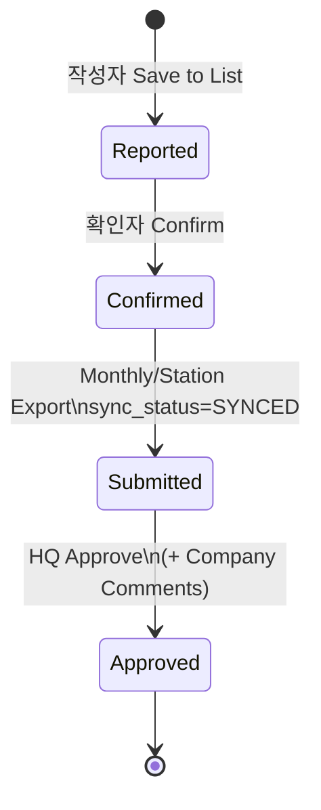
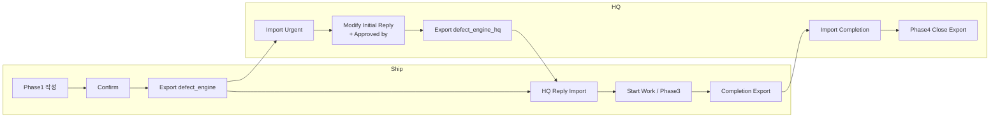
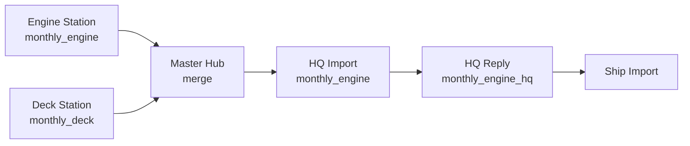

# TVC-PMS 업무 매뉴얼 v1.0

> **목적:** 선박 ↔ HQ 간 업무 흐름·상태·Export/Import 규칙의 **단일 기준(Single Source of Truth)**  
> **대상:** 시범 운영(incheonchemi), Engine/Deck 부서, HQ  
> **코드 기준일:** 2026-08-12  
> **관련 규칙:** `.cursor/rules/role-naming.mdc`

이 문서는 **현재 구현된 동작**을 기준으로 작성되었습니다. 시뮬레이션 중 발견된 차이는 **본 문서 → 코드 → 테스트** 순으로 반영합니다.

---

## 1. 용어

### 1.1 역할 (3단계)

| 단계 | 한글 | 데모 계정 | 코드 역할 | 목록 Status |
|------|------|-----------|-----------|-------------|
| 작성 | **작성자** | `engineer`, `officer` | `SHIP_OFFICER` | Reported / Draft |
| 확인 | **확인자** | `ce`, `captain` (`co`) | `SHIP_CHIEF`, `SHIP_CAPTAIN` | Confirmed |
| 승인 | **승인자** | `hq` | `HQ_SUPERVISOR` | Approved |

- UI·주석에서 **「승인(Confirm)」** = 확인자, **「승인(Approve)」** = 승인자(HQ)로 구분한다.
- 확인자·승인자는 작성자 역할을 **겸용**할 수 있다.

### 1.2 운영 Mode (PC)

| Mode | 로그인 | Station | 부서 | Export 주체 | Import 주체 |
|------|--------|---------|------|-------------|-------------|
| **Engine** | ENGINE | ECR | ENGINE | Chief engineer (`ce`) | `ce` |
| **Deck** | DECK | CCR | DECK | Chief officer (`co`) | `co` |
| **Master Hub** | MASTER | CAPTAIN | DECK+ENGINE | Captain (`captain`) | Captain |
| **HQ** | HQ | — | 토글(DECK/ENGINE) | HQ (`hq`) | HQ (`hq`) |

- 선박 데이터와 HQ 데이터는 **ZIP 파일로만** 주고받는다(오프라인 우선).
- **부서 토글**이 Import 파일의 engine/deck scope와 **일치**해야 한다.

### 1.3 공통 목록 Status (Work Report · Work Permit · Defect)

| 표시 | 의미 | 대표 조건 |
|------|------|-----------|
| **Draft** | 작성 중, 목록 미저장 | `visible_in_list === false` |
| **Reported** | 작성 완료, 확인 대기 | confirmed 없음 |
| **Confirmed** | 확인자 확인 완료, Export 대기 | confirmed 있음, `sync_status !== SYNCED` |
| **Submitted** | Export 완료(선박→HQ 전송됨) | confirmed + `sync_status === SYNCED` |
| **Approved** | HQ 승인 완료 | `approved_at` 또는 `is_locked` |

---

## 2. Export 파일명 규칙 (공통)

### 2.1 표준 패턴

```
{vessel}_{type}_{scope}_{YYYYMMDD}_{seq}.zip
```

| 토큰 | 설명 | 예 |
|------|------|-----|
| `vessel` | 선박 ID 소문자·공백 제거 | `incheonchemi` |
| `type` | 데이터 종류 | `defect`, `monthly`, `workpermit`, `postpone`, `requisition` … |
| `scope` | `engine` \| `deck` \| `hub` \| `engine_hq` \| `deck_hq` | Engine 선박 export → `engine` |
| `YYYYMMDD` | Export 일자 | `20260812` |
| `seq` | 당일·동일 prefix 순번 3자리 | `001`, `002` … |

- 순번(`seq`)은 `sync_history`의 동일 prefix 최대값 + 1로 자동 부여한다.
- **HQ 회신** scope는 `{engine|deck}_hq` (예: `engine_hq`).

### 2.2 Vessel Mode — 주요 type (Engine 예시)

| type | scope | 예시 파일명 |
|------|-------|-------------|
| `pms_backup` | engine | `incheonchemi_pms_backup_engine_20260812_001.zip` |
| `spare_backup` | engine | `incheonchemi_spare_backup_engine_20260812_001.zip` |
| `pms_master` | engine | `incheonchemi_pms_master_engine_20260812_001.xlsx` |
| `spare_master` | engine | `incheonchemi_spare_master_engine_20260812_001.xlsx` |
| `workpermit` | engine / hub | `incheonchemi_workpermit_engine_20260812_001.zip` |
| **`defect`** | **engine** | **`incheonchemi_defect_engine_20260812_001.zip`** |
| `postpone` | engine | (별도 레거시 패턴 — §5.2 참고) |
| `monthly` | engine | `incheonchemi_monthly_engine_20260812_001.zip` |
| `requisition` | engine | `incheonchemi_requisition_engine_20260812_001.zip` |
| `received` | engine | `incheonchemi_received_engine_20260812_001.zip` |
| `inventory` | engine | `incheonchemi_inventory_engine_20260812_001.zip` |

### 2.3 HQ Mode — 회신 scope

| type | scope | 예시 |
|------|-------|------|
| `monthly` | `engine_hq` | `incheonchemi_monthly_engine_hq_20260812_001.zip` |
| `defect` | `engine_hq` | `incheonchemi_defect_engine_hq_20260812_001.zip` |
| `workpermit` | `engine_hq` | `incheonchemi_workpermit_engine_hq_20260812_001.zip` |

### 2.4 배치 Export 원칙

- **Defect**, **Work Permit**: 선택한 여러 건을 **1개 ZIP**에 포함한다.
- ZIP 내부: JSON 1개 + 건별 HTML.
- 각 건에 `last_export_filename`에 배치 파일명을 기록한다.

---

## 3. Import 라우팅 (공통)

| Export 방향 | Import 가능 Mode | 비고 |
|-------------|------------------|------|
| `STATION_TO_HUB` (Engine/Deck → Master) | Master Hub, HQ(부서 토글) | Station PC에서 자기 ZIP Import **불가** |
| `SHIP_TO_HQ` (Master → HQ) | HQ | Captain Hub 전용 Export |
| `HQ_TO_SHIP` / `*_HQ_TO_SHIP` | Master / Engine / Deck | **부서 일치** 필수 |
| `DEFECT_URGENT_TO_HQ` | HQ | Defect 선박→HQ |
| `DEFECT_REPLY_HQ_TO_SHIP` | Ship | Defect HQ→선박 |
| `WORK_PERMIT_REQUEST_TO_HQ` | HQ | Work Permit 선박→HQ |
| `WORK_PERMIT_REPLY_HQ_TO_SHIP` | Ship | Work Permit HQ→선박 |

**공통 검증**

1. `vessel_id` 일치 (다른 선박 ZIP 차단)
2. 라이선스(company + vessel) — Electron Pilot
3. 부서 토글 ↔ 파일 scope 일치

---

## 4. Maintenance Work Report (정비 보고)

Maintenance Work Report는 **별도 ZIP type이 없고**, **Monthly Report** 또는 델타 Sync에 포함된다.

### 4.1 상태 흐름



### 4.2 역할별 작업

| 단계 | 담당 | 작업 | 부수 효과 |
|------|------|------|-----------|
| Reported | 작성자 | Work Report 작성·Save | — |
| Confirmed | 확인자 | Work History ☑ Confirm | 재고 차감, Job 일정 갱신(LAST DONE / NEXT DATE) |
| Submitted | 확인자 | Monthly Export (§7) | `sync_status = SYNCED` |
| Approved | 승인자 | HQ Import → Modify → Approve | `is_locked`, Company Comments 저장 |

### 4.3 Modify 규칙

| 목록 Status | 선박 작성자 | 선박 확인자 | HQ |
|-------------|------------|------------|-----|
| Reported | ✓ | — | ✓ |
| Confirmed | ✗ | ✓ | ✓ |
| Submitted | ✗ | ✗ | ✓ (Import 후 Approve 전) |
| Approved | ✗ | ✗ | ✗ |

- **Submitted 이후** 선박에서는 Modify **불가**.
- HQ: Import된 Submitted 건에 대해 **Company Comments** 편집 + **Approved by** 체크 → Approve.

### 4.4 HQ Approve (Maintenance)

- Work History에서 ☑ 선택 → **Approve** 일괄 처리 가능.
- **Confirmed by** (선박 확인)는 HQ Modify 시 **편집 불가**.
- **Approved by** → Superintendent 표시.

---

## 5. Postpone Work Report (연기 보고)

Critical Equipment 연기 보고. **별도 ZIP** Export/Import.

### 5.1 상태 흐름

Maintenance와 동일(Reported → Confirmed → Submitted → Approved).  
Critical 연기는 HQ **Approved Postpone Date** 필수.

### 5.2 Export

| 단계 | Actor | Direction | 전제 | 파일명 (현행) |
|------|-------|-----------|------|---------------|
| Request | Ship (Confirmed) | `POSTPONE_REQUEST_TO_HQ` | Confirmed, 미 Export | `{vesselId}_POSTPONE_REQUEST_{jobCode}_{date}.zip` |
| Reply | HQ (Approved) | `POSTPONE_REPLY_HQ_TO_SHIP` | Approved + approved date | `{vesselId}_POSTPONE_REPLY_{jobCode}_{date}.zip` |

> **v1.1 개선 예정:** Postpone도 `{vessel}_postpone_{engine|deck}_hq_{date}_{seq}.zip` 표준 패턴 통일.

### 5.3 HQ Modify

- Maintenance와 동일: Confirmed by 잠금, Company Comments·Approved by 편집 후 Approve.

---

## 6. Defect Report (결함 보고)

별도 엔티티(`defect_cases`). Work Report와 **분리**.

### 6.1 내부 Phase / Status

```
DRAFT → SUBMITTED_TO_COMPANY → COMPANY_REVIEWED → WORK_IN_PROGRESS
     → AWAITING_COMPLETION → CLOSED
```

### 6.2 목록 Status (UI)

Reported → Confirmed → Submitted → Approved  
(HQ `approved_at` 설정 시 Approved 표시)

### 6.3 End-to-End 흐름



### 6.4 선박 — Phase 1 Export

| 항목 | 규칙 |
|------|------|
| **전제** | 목록 Status = **Confirmed**, 미 Export |
| **파일명** | `incheonchemi_defect_engine_YYYYMMDD_001.zip` |
| **Direction** | `DEFECT_URGENT_TO_HQ` |
| **ZIP 내용** | `defect_case.json` + 건별 `DEFECT_{case_no}.html` |
| **배치** | 선택 N건 → **1 ZIP** |

Export 후 목록 Status → **Submitted** (`sync_status = SYNCED`).

### 6.5 HQ — Phase 2 (Initial Reply) **Export 전** 편집

| 필드 | Export 전 | Export 후 |
|------|-----------|-----------|
| Initial Reply (contents) | ✓ | ✗ |
| Date (`reply_date`) | ✓ | ✗ |
| REQUIRE TO REPORT TO | ✓ | ✗ |
| **Approved by** (Superintendent) | ✓ (체크/해제) | ✗ |
| Confirmed by (선박) | ✗ | ✗ |
| Phase 1 (선박 작성분) | ✗ | ✗ |

- **Save** = draft 저장 (잠금 없음, 반복 수정 가능).
- **Export** 시 아래 **모두 필수** — 미충족 시 Export 차단:

  1. Initial Reply from Company  
  2. Reply Date  
  3. Approved by  
  4. REQUIRE TO REPORT TO (Class / Flag / External / PSC / N/A 중 ≥1)

- Export 성공 시: `hq_reply_exported_at` 설정, `phase2_locked`, Status `COMPANY_REVIEWED`.

### 6.6 HQ — Phase 2 Export

| 항목 | 규칙 |
|------|------|
| **파일명** | `incheonchemi_defect_engine_hq_YYYYMMDD_001.zip` |
| **Direction** | `DEFECT_REPLY_HQ_TO_SHIP` |
| **배치** | 선택 N건 → **1 ZIP** |

### 6.7 선박 — Phase 3 · Completion Export

| 단계 | 전제 | Direction | 파일명 |
|------|------|-----------|--------|
| Phase 3 (Ship verify) | HQ Reply Import 후 | — | Modify (Approved 후) |
| Completion Export | defect cleared + verified | `DEFECT_COMPLETION_TO_HQ` | `incheonchemi_defect_engine_…` |

### 6.8 HQ — Phase 4 Close Export

| 항목 | 규칙 |
|------|------|
| **전제** | Status `AWAITING_COMPLETION`, Phase 4 입력 |
| **Direction** | `DEFECT_CLOSE_HQ_TO_SHIP` |
| **파일명** | `{vesselId}_DEFECT_CLOSE_{caseNo}_{date}.zip` (레거시) |

### 6.9 Modify 버튼 (Work History · Modal)

| Mode | Modify 가능 | Modify 불가 |
|------|-------------|-------------|
| **선박** | Reported, Confirmed | **Submitted**, Approved |
| **선박** (Submitted/Approved) | Ship's Comments 섹션만 (확인자) | 본문 Phase 1 |
| **HQ** | Import 후 ~ **HQ Reply Export 전** | HQ Reply Export 후 |

---

## 7. Work Permit

Critical Equipment 계획 정비 허가.

### 7.1 상태 흐름

Reported → Confirmed → Submitted → Approved (Defect·Work Report와 동일 목록 Status)

### 7.2 Export / Import

| 단계 | Actor | Direction | 전제 | 파일명 |
|------|-------|-----------|------|--------|
| Request | Ship | `WORK_PERMIT_REQUEST_TO_HQ` | Confirmed | `{vessel}_workpermit_{engine\|deck\|hub}_{date}_{seq}.zip` |
| Reply | HQ | `WORK_PERMIT_REPLY_HQ_TO_SHIP` | Approved | `{vessel}_workpermit_{engine\|deck}_hq_{date}_{seq}.zip` |

- 배치 Export: N건 → 1 ZIP.

### 7.3 HQ Modify

- **Confirmed by**: 편집 불가.
- **Approved by** + Company Comments: Approve 전 Modify 가능.

---

## 8. Monthly Report (월간 보고)

Engine/Deck → Master → HQ → Ship 회신 **4단계**.



### 8.1 단계별

| # | Actor | 작업 | Direction | 파일명 예 |
|---|-------|------|-----------|-----------|
| 1 | Engine `ce` | Monthly Export | `STATION_TO_HUB` | `incheonchemi_monthly_engine_…` |
| 2 | Captain | Station ZIP Import (Engine 토글) | — | — |
| 3 | Captain | Company Export | `SHIP_TO_HQ` | (Master 집계) |
| 4 | HQ | Import + Approve reports | — | — |
| 5 | HQ | Monthly Reply Export | `HQ_TO_SHIP` | `incheonchemi_monthly_engine_hq_…` |
| 6 | Ship | HQ Reply Import | — | Original Plan 잠금 해제 |

### 8.2 포함 데이터

- Maintenance Work Reports (Confirmed → Export 시 SYNCED)
- Defect cases (델타)
- Spare, Jobs, Run hours 등 부서 스냅샷

### 8.3 전제 조건

- **Station** Monthly Export: Update Work Plan 완료 필요(Master Hub 제외).

---

## 9. SPARE (요약)

| 단계 | Status (목록) | Actor | Export type |
|------|---------------|-------|-------------|
| 작성 | Reported | 작성자 | — |
| 확인 | Confirmed | 확인자 | — |
| 선박→HQ | Submitted | 확인자 | `requisition` |
| HQ 견적 | — | HQ | `quotation` |
| HQ 평가/발주 | — | HQ | `evaluation`, `order` |
| 입고 | Received | 확인자 | `received` |

- **작성자**도 Consumption List, Consumption Report, Receipt 기록 가능.
- 재고 마스터 수정·Confirm은 **확인자** 권한.

---

## 10. PMS / SPARE Master Excel

| 작업 | Actor | 파일명 |
|------|-------|--------|
| PMS Master Export | Master Hub Captain | `incheonchemi_pms_master_YYYYMMDD_001.xlsx` |
| SPARE Master Export | Master Hub Captain | `incheonchemi_spare_master_YYYYMMDD_001.xlsx` |

---

## 11. 시뮬레이션 시나리오 (v1.0 Acceptance)

매뉴얼 개선과 **병행**하여 아래 시나리오를 순서대로 검증한다.

### 11.1 Engine — Defect Happy Path

| # | Mode | 계정 | Given | When | Then |
|---|------|------|-------|------|------|
| D-1 | Engine | engineer | Job 선택 | Defect Report 작성·Save to List | Status Reported |
| D-2 | Engine | ce | Reported | Confirm | Status Confirmed |
| D-3 | Engine | ce | Confirmed + 필수 Phase1 | Menu Export Defect | `incheonchemi_defect_engine_*_001.zip` 1개 |
| D-4 | HQ | hq | Engine 토글 | Import Defect ZIP | Inbox/History 표시, Modify 가능 |
| D-5 | HQ | hq | Import됨 | Modify → Initial Reply/Date/REPORT TO/Approved by → Save | 저장·재편집 가능 |
| D-6 | HQ | hq | Save 완료 | Export (조건 미충족) | **차단** + missing 메시지 |
| D-7 | HQ | hq | 조건 충족 | Export | `incheonchemi_defect_engine_hq_*_001.zip` 1개 |
| D-8 | HQ | hq | Export 후 | Modify | **불가** |
| D-9 | Engine | ce | HQ Reply ZIP | Import | Approved, Phase3 편집 가능 |

### 11.2 Engine — Maintenance + Monthly

| # | Mode | 계정 | When | Then |
|---|------|------|------|------|
| M-1 | Engine | engineer | Work Report Submit | Reported |
| M-2 | Engine | ce | Confirm | Confirmed, schedule/stock 반영 |
| M-3 | Engine | ce | Monthly Export | `monthly_engine` ZIP |
| M-4 | Master | captain | Import Engine station | 데이터 병합 |
| M-5 | Master | captain | SHIP_TO_HQ Export | HQ Import 가능 |
| M-6 | HQ | hq | Approve + Company Comments | Approved |
| M-7 | HQ | hq | monthly_engine_hq Export | Ship Import 성공 |

### 11.3 Safety (부정 테스트)

| # | When | Then |
|---|------|------|
| S-1 | 다른 vessel_id ZIP Import | 차단 (VESSEL_MISMATCH) |
| S-2 | Engine ZIP을 Deck Mode에서 Import | 차단 (부서 불일치) |
| S-3 | Engine station이 자기 STATION ZIP Import | 차단 |
| S-4 | officer가 ENGINE job Report | 차단 (DEPT_FORBIDDEN) |

### 11.4 자동화 스크립트 (참고)

```bash
npm run test-vessel-engine-monthly-roundtrip   # Monthly 라운드트립
npm run test-vessel-engine-pms-workflow        # Work History / Defect batch
npm run verify-all                             # RBAC · Sync · License
```

> **v1.1:** `test-defect-ship-hq-roundtrip.mjs` — §11.1 전용 스크립트 추가 예정.

---

## 12. v1.0 알려진 제한 / v1.1 후보

| # | 항목 | 현재 | 개선 방향 |
|---|------|------|-----------|
| 1 | Postpone 파일명 | jobCode 기반 레거시 | `postpone_{engine\|deck}_hq` 표준화 |
| 2 | Defect Close 파일명 | `DEFECT_CLOSE_{caseNo}` | `defect_{engine\|deck}_hq` 통일 검토 |
| 3 | Defect Completion | 건별 export 가능 | 배치 ZIP 통일 검토 |
| 4 | Online Sync | UI scaffold | 실제 서버 연동 시 매뉴얼 §13 추가 |
| 5 | `docs/DEFECT_CASE.md` | Phase 명칭 구버전 | 본 매뉴얼과 동기화 |

---

## 13. 문서 변경 이력

| 버전 | 일자 | 변경 |
|------|------|------|
| **1.0** | 2026-08-12 | 최초 작성 — Mode, 역할, Defect/Work Report/Monthly/Export 파일명, HQ pre-export 규칙, Acceptance 시나리오 |

---

## 부록 A — 코드 참조

| 영역 | 파일 |
|------|------|
| 역할·Status | `js/rbac.js` |
| 파일명 | `js/core/filename.js` |
| Mode·Endpoint | `js/space.js` |
| Sync·Import 라우팅 | `js/services/sync.js` |
| Defect UI·Modify | `js/ui/defectReport.js` |
| Defect Export | `js/services/defectSync.js` |
| Work Permit Export | `js/services/workPermitSync.js` |
| Work Report Confirm/Approve | `js/services/transaction.js` |
| Menu Export/Import UI | `js/app.js` |
| Defect 스키마 | `js/core/schema.js` |

## 부록 B — 데모 계정 (password: `0000`)

| username | 역할 | 부서 |
|----------|------|------|
| engineer | 작성자 | ENGINE |
| ce | 확인자 | ENGINE |
| officer | 작성자 | DECK |
| co / captain | 확인자 | DECK / Master |
| hq | 승인자 | HQ |
